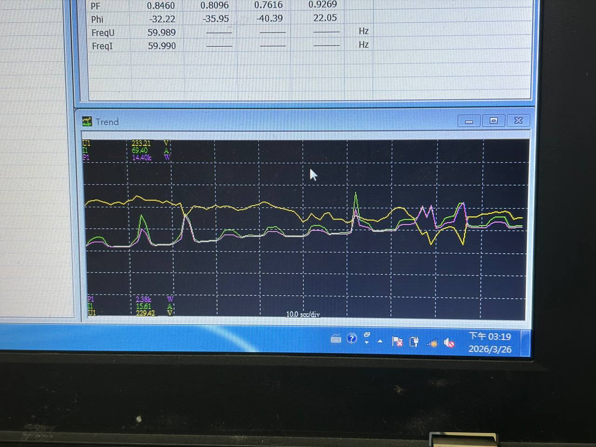
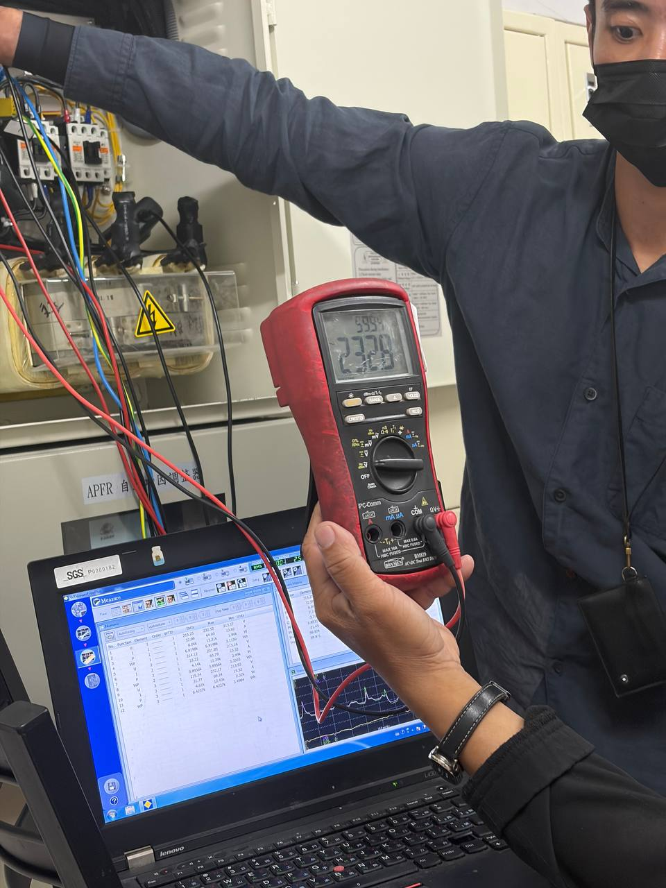
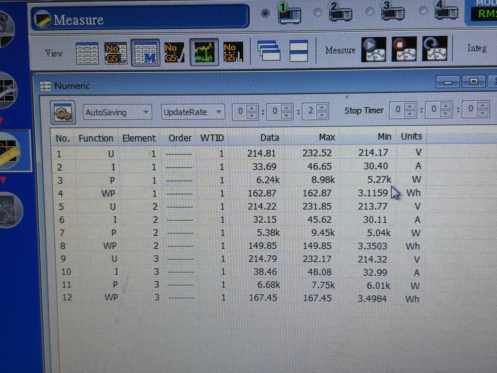
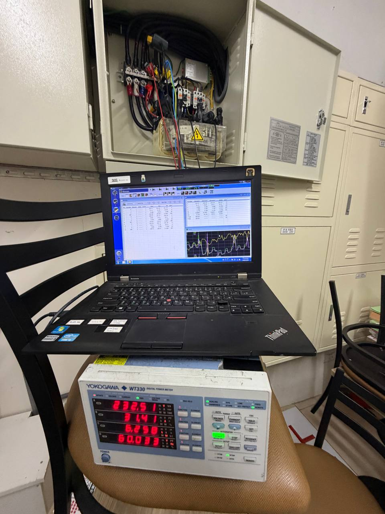

# 週報筆記 Description

**State:** open
**Labels:** chat-session
**Created by:** @xz9254442-alt
**Created at:** 2026-03-22 14:00:05.000 UTC

<!-- telegram-meta: {"chat_id":7887926843,"user_id":7887926843,"username":"j32638","chat_type":"private","ts":"2026-03-22T14:00:04.980Z"} -->

```json
{
  "name": "週報筆記",
  "description": "你存的週報格式規範是這樣：\n範本檔： 20260206工程管理週報2.docx\n基本設定：\n ∙ 字型：微軟正黑體\n ∙ 段落樣式：No Spacing\n表格結構： 三欄表格\n\n\n\n|專案名稱|本週進度|待辦下週計畫|\n|----|----|------|\n|…   |…   |…     |\n\n表頭色： 綠色 #007350"
}
```


---

### Comment by @xz9254442-alt at 2026-03-26 09:00:53.000 UTC

<!-- telegram-meta: {"chat_id":7887926843,"msg_id":295,"user_id":7887926843,"username":"j32638","chat_type":"private","ts":"2026-03-26T09:00:50.000Z","media_type":"photo"} -->

**來自：** James (@j32638) · j32638

---



相對位置：`assets/telegram/1774515652354_file_10.jpg`


---

### Comment by @xz9254442-alt at 2026-03-26 09:00:53.000 UTC

<!-- telegram-meta: {"chat_id":7887926843,"msg_id":289,"user_id":7887926843,"username":"j32638","chat_type":"private","ts":"2026-03-26T09:00:50.000Z","media_type":"photo"} -->

**來自：** James (@j32638) · j32638

---



相對位置：`assets/telegram/1774515652485_file_13.jpg`


---

### Comment by @xz9254442-alt at 2026-03-26 09:00:54.000 UTC

<!-- telegram-meta: {"chat_id":7887926843,"msg_id":293,"user_id":7887926843,"username":"j32638","chat_type":"private","ts":"2026-03-26T09:00:50.000Z","media_type":"photo"} -->

**來自：** James (@j32638) · j32638

---



相對位置：`assets/telegram/1774515652652_file_18.jpg`


---

### Comment by @xz9254442-alt at 2026-03-26 09:00:56.000 UTC

<!-- telegram-meta: {"chat_id":7887926843,"msg_id":308,"user_id":7887926843,"username":"j32638","chat_type":"private","ts":"2026-03-26T09:00:54.000Z","media_type":"photo"} -->

**來自：** James (@j32638) · j32638

---



相對位置：`assets/telegram/1774515655186_file_20.jpg`


---

### Comment by @xz9254442-alt at 2026-03-26 09:00:58.000 UTC

已根據 4 張照片內容完成週報整理。

---

**週報已辨識完成，內容如下：**

| 專案名稱 | 本週進度 | 待辦下週計畫 |
|---|---|---|
| SGS P0000182 電力品質量測 | 1. 現場架設 Yokogawa WT330 數位功率計，量測三相電力數據（232.5V / 60.033Hz）<br>2. 搭配 ThinkPad 筆電執行 WTViewerFreePlus 軟體進行即時數據擷取<br>3. 三相量測結果：相1（214.81V / 33.69A / 6.24kW）、相2（214.22V / 32.15A / 5.38kW）、相3（214.79V / 38.46A / 6.68kW）<br>4. 使用 BRYMEN BM829 三用電表量測 APFR 自動功因調整器配電盤端電壓（232.8V / 59.99Hz）<br>5. 趨勢圖分析 PF、Phi、FreqU、FreqI 等電力品質參數（PF：0.846、Phi：-32.22°） | 1. 彙整三相電力品質量測報告<br>2. 確認 APFR 功因調整器運作狀態是否符合規範<br>3. 完成 WTViewerFreePlus 資料匯出與分析 |

---

- Markdown：`workspaces/issue-3/outputs/weekly_report_20260326.md`

> 如需調整專案名稱、新增其他欄位或輸出為 .docx 格式（微軟正黑體 / No Spacing / 表頭 #007350），請告知。

<!-- githubclaw-brain-result: {"source":"githubclaw-worker-brain"} -->


---

### Comment by @xz9254442-alt at 2026-03-26 09:01:00.000 UTC

🦞「小龍蝦」已收到新指示，正在派工給 coding-agent。

<!-- githubclaw-brain-result: {"source":"githubclaw-worker-brain","requestTelegramMeta":{"chat_id":7887926843,"msg_id":308,"user_id":7887926843,"username":"j32638","chat_type":"private","ts":"2026-03-26T09:00:54.000Z","media_type":"photo"}} -->


---
